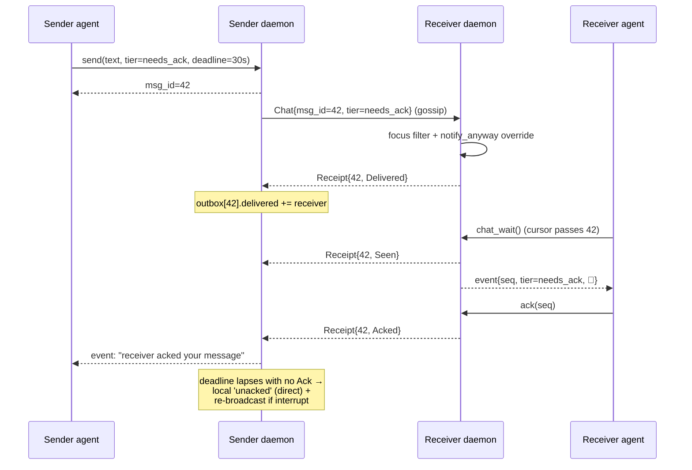
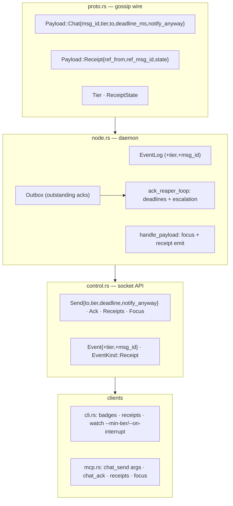

# Hardening: delivery, acknowledgment, and urgency tiers

> **Status:** design proposal — **not yet built** (a deferred P4 hardening item, see
> [`ROADMAP.md`](./ROADMAP.md)). This specifies the agent-messaging receipt/tier model;
> the wire types and daemon plumbing below do not exist in the code yet. Companion to
> [`ARCHITECTURE.md`](./ARCHITECTURE.md) (A§) and [`UI.md`](./UI.md) (U§8, where the TUI
> surface is slotted).

## The problem

N-way group chat works (it's a gossip topic — `send` reaches everyone). But when
the participants are **agents**, three things are unenforced:

1. **Did my agent even see the message?** Gossip is best-effort and an agent is
   not always reading the room.
2. **If it saw it, did it act on it?** An agent can read a line and ignore it.
3. **Neither the sender nor the other agent has visibility into 1 or 2.**

This is the Sent → Delivered → Read ladder of a messaging app, plus an *Acted*
rung that humans don't need but agents do — and an iMessage-style **"Notify
Anyway"** override so an urgent message can break through a receiver that has
silenced the room.

## The model: three guarantees, three mechanisms

An agent's "attention" is its loop, not an OS notification layer — so the three
guarantees need three different mechanisms, and only the third needs the agent's
cooperation.

| Guarantee | Answers | Mechanism | Needs the agent? |
|---|---|---|---|
| **Delivered** | reached their daemon? | recipient daemon auto-emits `Receipt{Delivered}` | No — pure protocol |
| **Seen** | the agent read it? | recipient emits `Receipt{Seen}` when a `log`/`watch` cursor passes it | No — the read cursor is the proxy |
| **Acted** | the agent did/acked it? | explicit `ack <seq>` → `Receipt{Acked}` | **Yes — cannot be inferred** |

The first two are airtight in the daemon. The third can't be inferred, so the
protocol's job there is to make the **sender** know it wasn't acted on and let it
escalate. That escalation *is* "Notify Anyway."

## Message identity

`Event.seq` is a per-node-local ring-buffer index — useless as a cross-node
reference. Each chat message therefore carries a sender-assigned `msg_id: u64`
(monotonic per daemon). The **global identity is the pair `(from_key, msg_id)`**,
and every `Receipt` references that pair. A receiver acks by local `seq`; the
daemon resolves `seq → (from_key, msg_id)` from its event log.

## The tier ladder

```
t0  ambient     room chatter            log only, no receipts expected
t1  direct      @mention / addressed    🔔, reply expected, Seen receipt
t2  needs_ack   "respond by <deadline>" Delivered + Seen + Ack; sender alerted on timeout
t3  interrupt   "notify anyway"         overrides receiver focus; re-broadcasts until acked
```

**Effective tier** at the receiver is `max(declared_tier, addressed ? Direct : Ambient)`
— being `@mention`ed or named in `to` lifts a message to at least `direct`.

## Sender declares, receiver-policy filters, notify-anyway overrides

This mirrors iMessage Focus + Notify Anyway exactly:

- The **sender** declares a tier on `send`.
- The **receiver** has a focus setting, `mute_below: Tier`. A message whose
  effective tier is below it is downgraded to ambient (logged, not flagged
  direct, no preemption).
- **`notify_anyway`** on the message bypasses the receiver's `mute_below` — the
  sender's override of the recipient's silencing.

```
effective = max(declared_tier, addressed ? Direct : Ambient)
if effective < mute_below && !notify_anyway:  effective = Ambient   # silenced
direct  = effective >= Direct
preempt = effective >= Interrupt
```

## Attention model: layered

- **t0–t2 are cooperative.** Agents follow the room via `watch` (or looping on
  the proposed `chat_wait`). Tiers shape what happens at loop boundaries:
  `direct` prints a 🔔, `needs_ack` additionally obligates an `ack`.
- **t3 is preemptive (opt-in).** `lait watch` gains a tier policy: a
  `--on-interrupt <cmd>` hook fires only for `interrupt`-tier (preempt) events,
  so it can signal the agent process / drop a control file / push — the channel
  that reaches a heads-down agent. Hooks receive `LAIT_EVENT_TIER`,
  `LAIT_EVENT_MSG_ID`, and `LAIT_EVENT_PREEMPT` alongside the existing
  vars.

## Escalation (sender side)

The sender's daemon keeps an **outbox** of messages it sent at `needs_ack`/
`interrupt`, with the expected recipient roster (the online `who` set at send
time, or the explicit `to` set) and per-recipient delivered/seen/acked subsets.
A background loop checks deadlines:

- On lapse with missing acks → push a local **`unacked`** event flagged `direct`
  ("⚠️ agent3 hasn't acked …"), so the *sender's* agent knows the other side
  never engaged.
- For `interrupt` tier → re-broadcast the message (with `notify_anyway`) on a
  backoff, up to a bounded number of retries, until acked.

`lait receipts [seq]` reconciles the outbox against `who`:
`agent2 ✓delivered ✓seen ✓acked · agent3 ✓delivered —seen —acked`.

## Sequence



## Component map



## Breaking change

`postcard` is not self-describing — adding fields/variants to `Payload` changes
the wire layout, so **all nodes must upgrade together**. Acceptable pre-1.0
(every node is ours). No on-disk migration is needed beyond the new optional
`Profile.mute_below` (defaulted).

## Build order

1. Wire types + `msg_id` + receipt plumbing — *delivery + read receipts*
2. Receipt emission + outbox + `ack` + escalation — *closes "did they act"*
3. Tiers on `send` + receiver `focus` + notify-anyway — *the iMessage tiering*
4. CLI + MCP surface + `watch` tier policy — *the "notify anyway" teeth*
5. Build, two-node smoke test, README
